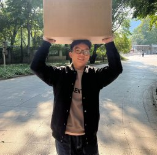
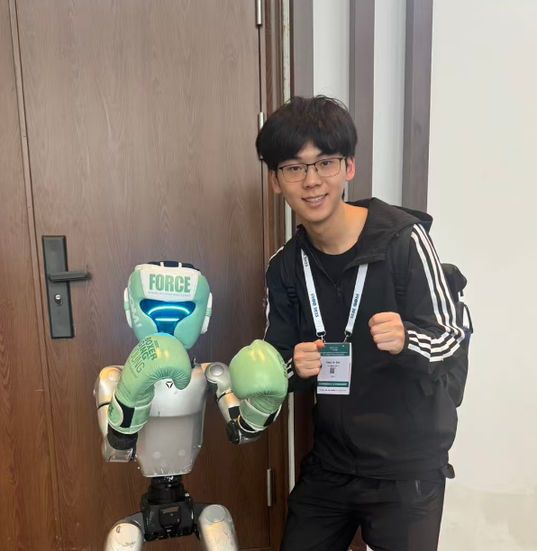

  <h1>⚡️ SenseLabRobo ⚡️</h1>
  <h3>Tsinghua University | 清华大学</h3>

  

    

  

    

  

    
    
  

---

## 🔮 Our Mission

At **SenseLabRobo**, we define the frontier of **Embodied AI**. We don't just build robots; we endow them with the ability to *sense* complex environments, *understand* semantic contexts, and *act* with agility and precision. Our research fuses multi-modal perception with advanced control theories to create intelligent machines that operate in the real world.

 

## 🧠 Core Research Pillars

<table align="center" style="border: none; width: 100%;">
  <tr>
    <td width="33%" align="center" style="border: none; padding: 10px;">
      <h1>👁️</h1>
      <h3>Multi-Modal Perception</h3>
      
Fusing LiDAR, Camera, Radar, and IMU data for robust state estimation and semantic mapping in unstructured environments.

    </td>
    <td width="33%" align="center" style="border: none; padding: 10px;">
      <h1>🦵</h1>
      <h3>Agile Locomotion & Control</h3>
      
Developing model-predictive control and reinforcement learning frameworks for dynamic legged and wheeled robots.

    </td>
    <td width="33%" align="center" style="border: none; padding: 10px;">
      <h1>🤖</h1>
      <h3>Embodied AI & Learning</h3>
      
Bridging the gap between simulation and reality (Sim2Real) for autonomous decision-making and manipulation tasks.

    </td>
  </tr>
</table>

 

## 🧬 The Team

Driven by curiosity, united by code. We are a diverse group of researchers at Tsinghua.

<table style="border: 1px solid var(--color-border-muted); background-color: var(--color-canvas-subtle); border-radius: 16px; padding: 20px; width: 95%; margin: auto; box-shadow: 0 5px 20px rgba(0, 0, 0, 0.05);">
  <tr>
    <td align="center" width="200px" valign="top" style="border: none; padding-right: 20px;">
      
    </td>
    <td valign="top" style="border: none;">
      <h2 style="margin-top: 0; margin-bottom: 5px;">Dr. Fei Qiao</h2>
      <b>Principal Investigator / Associate Professor</b> 
      Department of Electronic Engineering, Tsinghua University 
       
      🧠 <b>Research Lead:</b> Edge Embodied Intelligence, Flexible Wearable Device，Near-zero Power Chips，High Energy Efficiency Intelligence System 
      ✉️ <a href="qiaofei@tsinghua.edu.cn">Email Contact</a> | 🌐 <a href="https://web.ee.tsinghua.edu.cn/qiaofei/zh_CN/index.htm">Faculty Homepage</a>
    </td>
  </tr>
</table>

 

### Core Members & Researchers

<table align="center" style="border: none; width: 100%; margin-top: 20px;">
  <tr>
    <td align="center" valign="top" width="25%" style="border: none; padding: 15px;">
      
       
      <strong style="font-size: 1.1em;">Qian Zhang (Leader)</strong> 
      

        Ph.D. Candidate 
        Tsinghua SIGS, Tsinghua University 
        Focus: Perception & SLAM
        

          <a href="mailto:qian.zhang@email.com" style="text-decoration: none; color: #660099; margin-right: 10px;" title="Email">✉️ Email</a>
          |
          <a href="https://your-homepage.com" target="_blank" style="text-decoration: none; color: #660099; margin-left: 10px;" title="Personal Homepage">🌐 Web</a>
        

      

    </td>
    <td align="center" valign="top" width="25%" style="border: none; padding: 15px;">
      
       
      <strong style="font-size: 1.1em;">Haohua Que (Collaborator)</strong> 
      

        Ph.D. Student 
        College of Engineering, University of Georgia 
        Focus: Robotic Control
        

          <a href="mailto:haohua.que@email.com" style="text-decoration: none; color: #660099; margin-right: 10px;" title="Email">✉️ Email</a>
          |
          <a href="#" target="_blank" style="text-decoration: none; color: #660099; margin-left: 10px;" title="Personal Homepage">🌐 Web</a>
        

      

    </td>
    <td align="center" valign="top" width="25%" style="border: none; padding: 15px;">
      
       
      <strong style="font-size: 1.1em;">Haojia Gao</strong> 
      

        Master Student 
         Tsinghua SIGS, Tsinghua University 
        Focus: Embodied Intelligence 
        

          <a href="mailto:intelligent@gaohaojia.top" style="text-decoration: none; color: #660099; margin-right: 10px;" title="Email">✉️ Email</a>
          |
          <a href="https://gaohaojia.github.io/index.html" target="_blank" style="text-decoration: none; color: #660099; margin-left: 10px;" title="Personal Homepage">🌐 Web</a>
        

      

    </td>
    <td align="center" valign="top" width="25%" style="border: none; padding: 15px;">
      
       
      <strong style="font-size: 1.1em;">[Student Name]</strong> 
      

        Research Assistant 
        Dept. of [Name], Tsinghua Univ. 
        Focus: Hardware Design
        

          <a href="mailto:student@email.com" style="text-decoration: none; color: #660099; margin-right: 10px;" title="Email">✉️ Email</a>
          |
          <a href="#" target="_blank" style="text-decoration: none; color: #660099; margin-left: 10px;" title="Personal Homepage">🌐 Web</a>
        

      

    </td>
  </tr>
</table>
 
 

## 🛠️ The SenseLab Tech Stack

We leverage cutting-edge tools to power our research.

### ▸ Platforms & Middleware

  
  
  
  
  

### ▸ Core Languages & Libraries

  
  
  
  
  
  

### ▸ Hardware Focus

  
  
  
  

 
 

  

  <h3>Innovating at Tsinghua University.</h3>
  
We are always looking for passionate collaborators and students.

  

    <a href="mailto:contact@senselab.thu.edu.cn">✉️ Contact Us</a> | 
    <a href="#">📄 Publications</a> | 
    <a href="https://github.com/SenseLabRobo">🐙 GitHub Profile</a>
  </button>
    
  © 2025 SenseLabRobo. All rights reserved.

